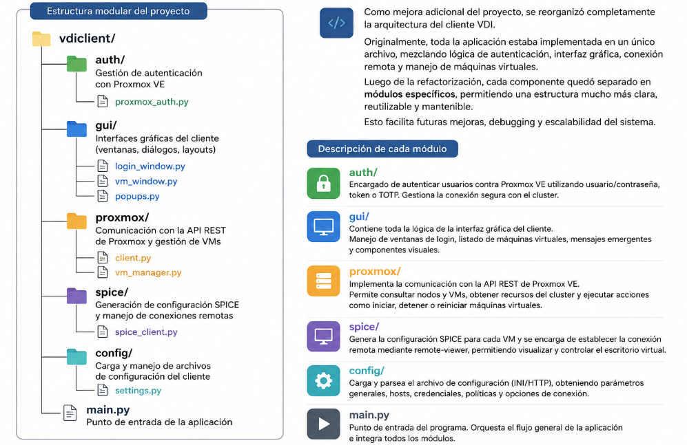

# PVE VDI Client

## Descripción

**PVE VDI Client** es un cliente VDI simple y liviano diseñado para despliegues masivos.  
La aplicación se conecta directamente a entornos **Proxmox VE** y permite que los usuarios accedan mediante **SPICE** a las máquinas virtuales para las cuales poseen permisos.

El cliente soporta múltiples clusters de Proxmox, permitiendo que el usuario seleccione fácilmente a qué grupo de servidores desea conectarse.

---


# Archivo de Configuración

PVE VDI Client **requiere obligatoriamente** un archivo de configuración para funcionar.

El cliente buscará automáticamente el archivo `vdiclient.ini` en las siguientes ubicaciones, salvo que se indique otra mediante parámetros de línea de comandos.

## Windows

    * %APPDATA%\VDIClient\vdiclient.ini
    * %PROGRAMFILES%\VDIClient\vdiclient.ini

## Linux

    * ~/.config/VDIClient/vdiclient.ini
    * /etc/vdiclient/vdiclient.ini
    * /usr/local/etc/vdiclient/vdiclient.ini


## Requisitos de Permisos en Proxmox


Los usuarios que accedan a instancias VDI deben poseer los siguientes permisos asignados sobre cada máquina virtual:

VM.PowerMgmt
VM.Console
VM.Audit

# Uso por Línea de Comandos

No es necesario utilizar parámetros para el funcionamiento básico del cliente.

## Opciones disponibles

```bash
usage: vdiclient.py [-h] [--list_themes]
                    [--config_type {file,http}]
                    [--config_location CONFIG_LOCATION]
                    [--config_username CONFIG_USERNAME]
                    [--config_password CONFIG_PASSWORD]
                    [--ignore_ssl]
```

## Parámetros

| Parámetro | Descripción |
|---|---|
| `-h`, `--help` | Muestra la ayuda |
| `--list_themes` | Lista todos los temas disponibles |
| `--config_type {file,http}` | Define el tipo de configuración |
| `--config_location` | Ubicación del archivo o URL de configuración |
| `--config_username` | Usuario para autenticación HTTP Basic |
| `--config_password` | Contraseña para autenticación HTTP Basic |
| `--ignore_ssl` | Ignora errores de certificados SSL |

---

## Configuración vía HTTP

Si se utiliza:

```bash
--config_type http
```

debe especificarse la URL mediante:

```bash
--config_location
```

### Ejemplo

```bash
python3 vdiclient.py \
  --config_type http \
  --config_location https://servidor/config/vdiclient.ini
```

---

# Instalación en Windows

## Requisito previo

Es obligatorio instalar previamente:

- **virt-viewer**

Puede descargarse desde el sitio oficial:

- https://virt-manager.org/download/

---

## Instalación mediante MSI

Las versiones precompiladas pueden descargarse desde la sección de *Releases* del proyecto.

---

## Compilar instalador personalizado

Si necesita personalizar la instalación, firmar ejecutables o generar un MSI propio:

1. Instalar:
   - WIX Toolset

2. Ejecutar:

```bat
build_vdiclient.bat
```

---

## Dependencias Python

Debe instalar Python 3.12 y luego ejecutar:

```bat
requirements.bat
```

---

# Instalación en Linux (Debian/Ubuntu)

Ejecutar los siguientes comandos:

```bash
apt install python3-pip python3-tk virt-viewer git

git clone https://github.com/joshpatten/PVE-VDIClient.git

cd ./PVE-VDIClient/

chmod +x requirements.sh

./requirements.sh

cp vdiclient.py /usr/local/bin

chmod +x /usr/local/bin/vdiclient.py
```

---

# Instalación en Fedora / CentOS / RHEL

Ejecutar los siguientes comandos:

```bash
dnf install python3-pip python3-tkinter virt-viewer git

git clone https://github.com/joshpatten/PVE-VDIClient.git

cd ./PVE-VDIClient/

chmod +x requirements.sh

./requirements.sh

cp vdiclient.py /usr/local/bin

chmod +x /usr/local/bin/vdiclient.py
```

---

# Compilar Binario para Debian/Ubuntu

Si desea generar un binario standalone utilizando PyInstaller:

```bash
apt install python3-pip python3-tk virt-viewer git

git clone https://github.com/joshpatten/PVE-VDIClient.git

cd ./PVE-VDIClient/

chmod +x requirements.sh

./requirements.sh

pip3 install pyinstaller

pyinstaller --onefile \
  --noconsole \
  --noconfirm \
  --hidden-import proxmoxer.backends \
  --hidden-import proxmoxer.backends.https \
  --hidden-import proxmoxer.backends.https.AuthenticationError \
  --hidden-import proxmoxer.core \
  --hidden-import proxmoxer.core.ResourceException \
  --hidden-import subprocess.TimeoutExpired \
  --hidden-import subprocess.CalledProcessError \
  --hidden-import requests.exceptions \
  --hidden-import requests.exceptions.ReadTimeout \
  --hidden-import requests.exceptions.ConnectTimeout \
  --hidden-import requests.exceptions.ConnectionError \
  vdiclient.py
```

Una vez finalizado el proceso, el binario estará disponible en:

```txt
dist/vdiclient
```

---
